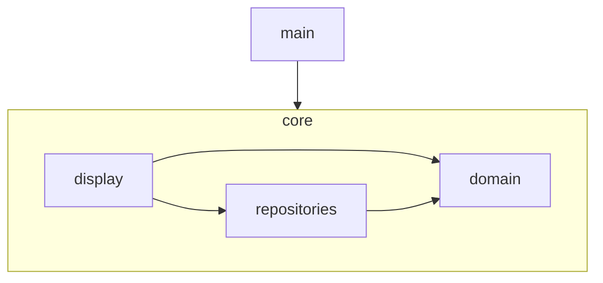
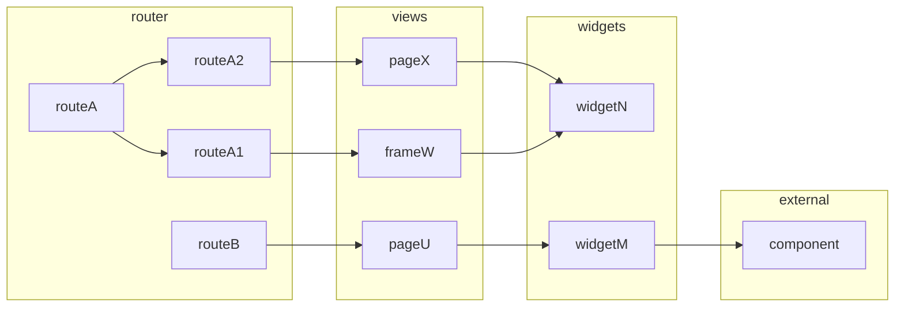

# Architecture

## Layers

The arrows represent wich modules depends on. In that case the control module depends on the view module but the view knows nothing about the control.

## Main

Starts the applicaton, initializes app level state and stablish runtime dependencies.

## Display

Make the app move. It grabs and transform state from `domain` and show it to the user, then captures events triggered by the user ans translates them into funtion or method calls to `domain`.

### Routes

The top structure starts at the route level. Routes are objects that define the entry points available to the user. The shape of the route objects are defined by the vue-router library API.

The route will render zero or one view component. Routes can have children routes to enable view nesting. It can render a control for a frame in case of a shared layout and then a child route with the corresponding main page.

### Views

Views are what the user see in the end. They access the domain via a central construct called Store. All data they need they grab from the store user signals are convert to calls to the store inner methods.

Views can be complex structures in order to deal with data orchestrations. They can abstract its capacities into subcomponets or composables to streamline code.

### Widgets

They are shared resources (components and composables) used by more than one view or other widgets.

Widgets are also used to function as single entry points for outside UI dependencies. Like if some button from a UI library is used in the app, for example. On that case, the button should be imported in a proxy ButtonBase widget and then used in pages, even if for a single page.

### Styles

Styles are guided by design tokens that came from the Prime Vue UI library (mainly colors) and from the Open Props library (mainly sizes).

The project uses vanilla CSS with design tokens coming from custom properties. The project does not use utility classes even when available. That is way open props is used instead of TailwindCss.

## Domain

Domain is the app logic running in a vacum without care about `views` and just with bare interfaces for `repositories`.

### Separeta state from logic

Computation logic should be isolated in pure function whenever possible, even if they will be used to enable classes methods.

This isolation avoid big classes files that are hard to read, avoid side effects in state that are hard to locate and makes testing easier.

### Be simple and let upper layers carry some load

The domain has a concise as possible properties and methods to allow state mutation, asserting business rules, and exposing essencial data to the top layers.

These types are not meant to be flexible or adapt to every needs of the UI. The point here is simplicity and communality. Views will extedend upon the domain to reach their needs.

When adding something to the domain ask yourself, does the domain doesn't already expose this? if so, create the capability in the consumer.

## Domain is the last mile

If some logic is reused everywhere the domain is the place to put it. We don't have a utils folder.

This is intentional to disincentiveze generic lib features. Everything should be written to attend the current needs and the package mindset is considered bad design.

If some utility function is needed in only one place, keep that function there no in the domain. It should be moved to the domain only when multiple top-level modules require it.

## Repositories

Repositories is the module with the logic to persist and recover real data for medias like the file system and the local storage. It also provides services utilities for things like checking if the user browser supports the repository technology.

# Design choices

These are not general design claims for the community. These are local desicions applicable only to these apps. Do not interpret this decisions as something we believe should be done for other apps.

## Avoid uncertain use of complexity

Nothing in this app, even utilities like features, is coded with a mindset to be later used in other apps or libs. this kind of design bring complexity. This app code has to be as focuses as possible. Some capability is added only when indispensible to achive some app known and present goal.

## Small functions

Functions should be as small as possible. They should do one thing and have preferably a single input and two at most. 

[How small should a function be? - Robert C. Martin (Uncle Bob)](https://www.youtube.com/watch?v=rXjf8eiGsSI).

## Test Modules not Files

No need to unit test every function and also no need to worry about the testing emcompassing inner structures. Tests should focus on verifying modules outcomes with none to litte mocking. Inner modules functions can change at will with side effecting multiple tests.

[There is No Such Thing as a Unit Test](https://dev.to/awwsmm/there-is-no-such-thing-as-a-unit-test-50j3)

## Do not use global stores

Global store incentivise black holes modules that aim to solve many problems.This creates unintended dependencies. Expose every bit of state carefully by atomic exposure.