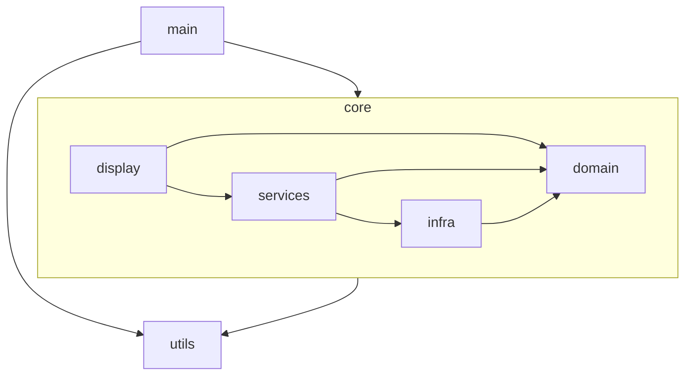
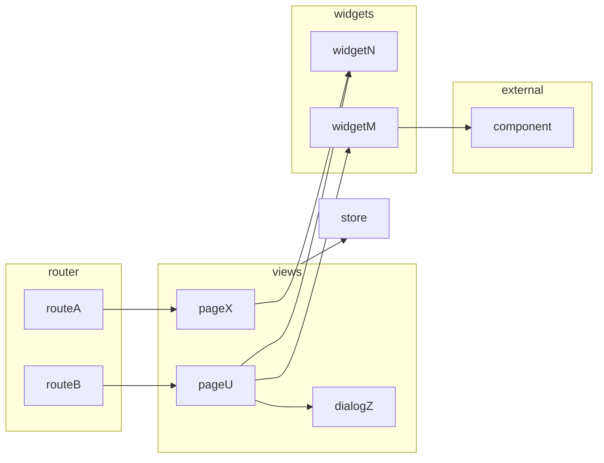

# Architecture

## Layers

The arrows represent wich modules depends on. In that case the control module depends on the view module but the view knows nothing about the control.

## Main

Starts the applicaton, initializes app level state and stablish runtime dependencies.

## Display

Make the app move. It grabs and transform state from `domain` using `services` and show it to the user, then captures events triggered by the user and translates them into calls to `services`.

### Routes

The top structure starts at the route level. Routes are objects that define the entry points available to the user. The shape of the route objects are defined by the vue-router library API. 

The route will render a view component. 

The library supports the concept of nested routes to enable a sort of layout structure. This is not allowed in this app design. This approach couples the route configuration to the component tree and can become a maintence burden. 

Pages should mount their layout inside their own template. They can reuse capabilities by composing the layout with widgets.

### Views

Views are what the user see in the end. They access the services and domain via a central construct called Store. All data they need they grab from the store user signals are convert to calls to the store inner objects.

Views can be complex structures in order to deal with data orchestrations. They can abstract its capacities into subcomponets or composables to streamline code.

They can be pages to be placed in the router routes or also components to be used inside pages like dialogs or frames. The distinc feature of a view it access the store to complete its tasks.

### Widgets

They are shared resources (components and composables) used by more than one view or other widgets that do not have access to the app state. All state used by a widget must be provided as a prop and all changes it want to provoque must by raised as events.

Widgets are also used to function as single entry points for outside UI dependencies. Like if some button from a UI library is used in the app, for example. On that case, the button should be imported in a proxy ButtonBase widget and then used in pages, even if for a single page.

### Styles

Styles are guided by design tokens that came from the Prime Vue UI library (mainly colors) and from the Open Props library (mainly sizes).

The project uses vanilla CSS with design tokens coming from custom properties. The project does not use utility classes even when available. That is way open props is used instead of TailwindCss.

## Domain

Domain is the app logic running in a vacum without care about any other core module. 

This is a simple module focus on representing data and behaviour that is not dependent of external medida. These domain structures are not meant to encapsulate UI tasks. The point here is simplicity and communality. 

Service will later provide the UI with the appropriate use cases that are able to communicate with the infra structures.

## Infra

Infra is the module with the logic to persist and recover real data for media like the file system and the local storage. It also provides services utilities for things like checking if the user browser supports the repository technology.

Infra knows about the domain so it can manipulate the proper data structures but should not know about display and services.

## Services

To be written...

## Utils

Here resides features used by multiple modules that cares no business logic. 

Be aware that generic lib features are considered bad design. Everything should be written to attend the current needs.

# Design choices

These are not general design claims for the community. These are local desicions applicable only to these apps. Do not interpret this decisions as something we believe should be done for other apps.

## Avoid uncertain use of complexity

Nothing in this app, even utilities like features, is coded with a mindset to be later used in other apps or libs. this kind of design bring complexity. This app code has to be as focuses as possible. Some capability is added only when indispensible to achive some app known and present goal.

## Focused classes

Classes should be as single responsability as possible. They should do one thing and operate at a single level of abstraction.

You can create inner classes to isolate related groups of methods like in Hash and Hierarchy examples for the Nodes class.

[How small should a function be? - Robert C. Martin (Uncle Bob)](https://www.youtube.com/watch?v=rXjf8eiGsSI).

## Test Modules not Files

No need to unit test every function and also no need to worry about the testing emcompassing inner structures. Tests should focus on verifying modules outcomes with none to litte mocking. Inner modules functions can change at will with side effecting multiple tests.

[There is No Such Thing as a Unit Test](https://dev.to/awwsmm/there-is-no-such-thing-as-a-unit-test-50j3)

## Do not use global stores

Global store incentivise black holes modules that aim to solve many problems.This creates unintended dependencies. Expose every bit of state carefully by atomic exposure.

## Postpone branches and dependencies

If a inner class needs two piece of data to operate, require them at the constructor. Do not accept another class that maybe has the data in it and them create logic to check and throw. If this outer classes changes, now you have to update your inner class too. 

Let the code that constructs the inner class check if the data exists even if it envolves more boilerplate. The code will be easier to understand.