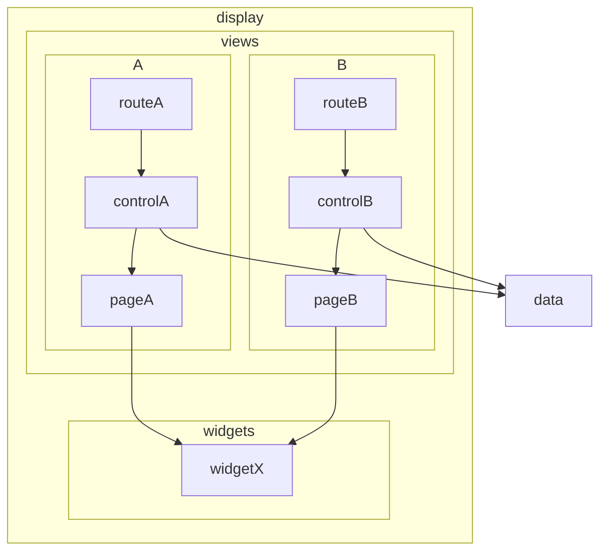

# Architecture

## Display

The display layer takes care of the app UI. The main elements are routes, controls, pages and widgets.

### Views

The top of the display vertical structure start at the route level. Routes are objects that define the SPA display entry points. The shape of the route objects are defined by the vue-router library API.

The route will render a control component. The control component is the only level in the display module that knows about the app state. Controls are able to read from data and dispatch commands to it.

Every route and control are followed by a page component. Pages are what the user see in the end. They know nothing the app state. All data they need they receive as props and every signal they send is done by events.

They receive and send data in the shape they need. Transformations must happen at the control leve before.

This three component structure easy maintence. Routes are a SPA tech requirement and are kept as simple as possible to reduce dependency. Pages are complex structures worried only about the UI requirements and only change by that motivation. Controls carry the burden of translating interfaces between display and data.

Route, control and page are kept together inside the view folder divided by subfolder with the route names.

### Widgets

They are pages piecies reused by more than one page. They obey the same restriction as page components.

### Styles

Styles are guided by design tokens that came from the Prime Vue UI library (mainly colors) and from the Open Props library (mainly sizes).

The project uses vanilla CSS with design tokens coming from custom properties. The project does not use utility classes even when available. That is way open props is used instead of TailwindCss.

## Data

### Patterns

No classes. Promote complexity with excessive abstraction.

Data is centralized in a global object.

### Artifacts Representation

Every artifact gains a UUID and its parent UUID upon retriaval this is done to decouple it from other istances and make manipulation freer.

### Store

- keeps reactive data to use in views. computations should be done in controls combining computed with data function. global store stores the basic raw data inside reactive constructs

### Media

- Process calls to persists data
- Process calls to read data

There are three implementations of the media interface: FileSystemMedia for primary machines, WebRtcMedia for connected machines like mobile and MemoryMedia (for testing).