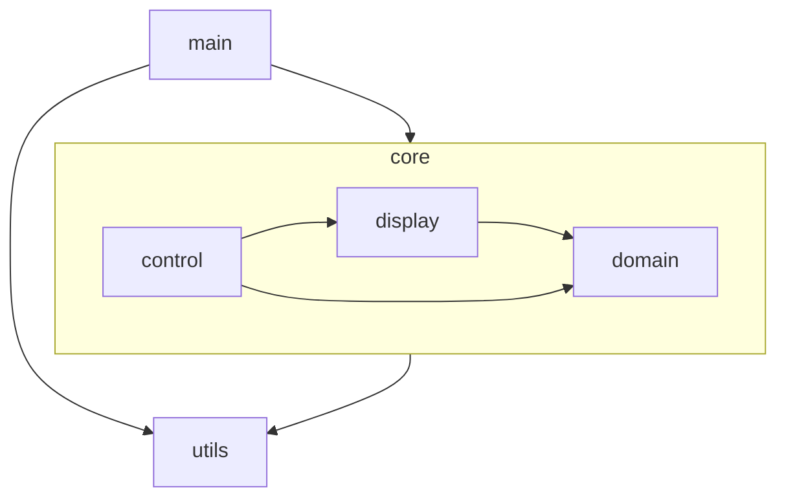
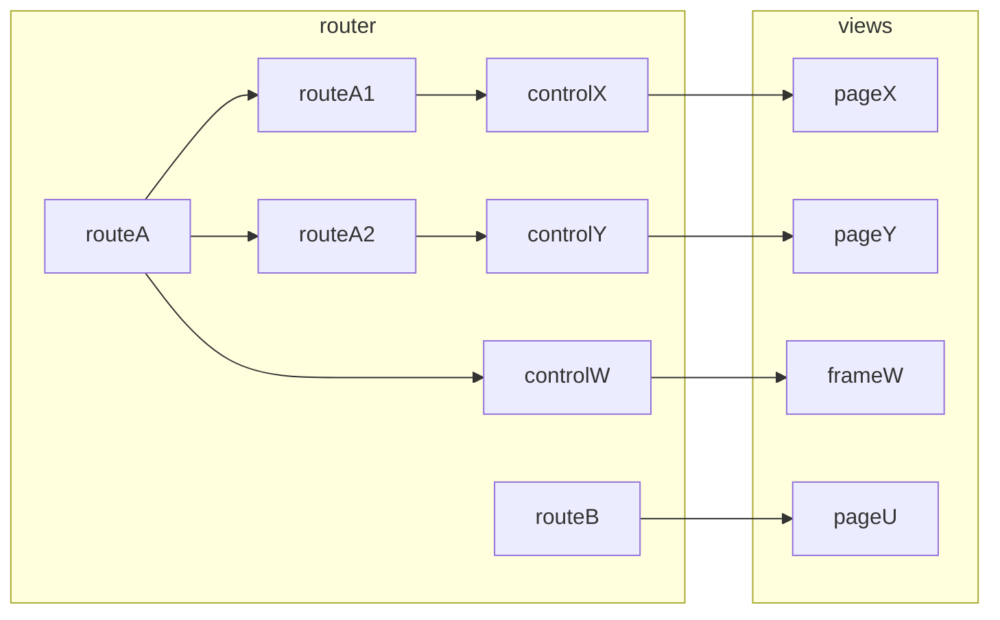

# Calystone

Self management system based on your file system.

# Architecture

## Layers

The arrows represent wich modules depends on. In that case the control module depends on the view module but the view knows nothing about the control.

## Design strategies

Nothing in this app, even utils, is coded to be used in other apps or libs. this kind of design bring complexity. This app code has to be as focuses as possible. Complexity is added only when indispensible to achive some app known and present goal.

## Main

Starts the applicaton, initializes app level state and stablish runtime dependencies.

## Control

Make the app data move to attend the user signals. It transforms state from `domain` to the format needed by `display` and convert events triggered by the user in `display` into action calls to `domain`.

The top of the control structure starts at the route level. Routes are objects that define the SPA display entry points available to the user. The shape of the route objects are defined by the vue-router library API.

The route will render a zero or one control or view component. Routes can have children routes to enable control/view nesting. It can render a control for a frame in case of a shared layout and then a child route with the corresponding main page.

## Display

The display layer takes care of the app UI. The main sublayers are `views`,  `widgets` and `components`.

### Views

Views are what the user see in the end. They know nothing about the app state. All domain they need is received as props and every signal they send is done by events.

They receive and send domain in the shape they need. Transformations must happen at the control level.

Views can be complex structures but will always worry only about the UI requirements and only change by that motivation. Controls carry the burden of translating interfaces between display and domain.

### Widgets

They are shared resources used by more than one view or other widgets. They obey the same restriction as page components.

### Styles

Styles are guided by design tokens that came from the Prime Vue UI library (mainly colors) and from the Open Props library (mainly sizes).

The project uses vanilla CSS with design tokens coming from custom properties. The project does not use utility classes even when available. That is way open props is used instead of TailwindCss.

## Domain

Domain is the bussiness logic running in a vacum without care about `controls` or `views`.

Its has as concise as possible reactive state and function to allow state mutation asserting business rules.

These types are not meant to be flexible are adapt to every needs. The point here is simplicity and communality. Other modules will extedend themselves from the domain to futher implement their needs.

## Utils

Language or technology helpers that don't need to be aware of bussiness rules and don't need runtime state goes here. Utils only knows about utils and nothing else.