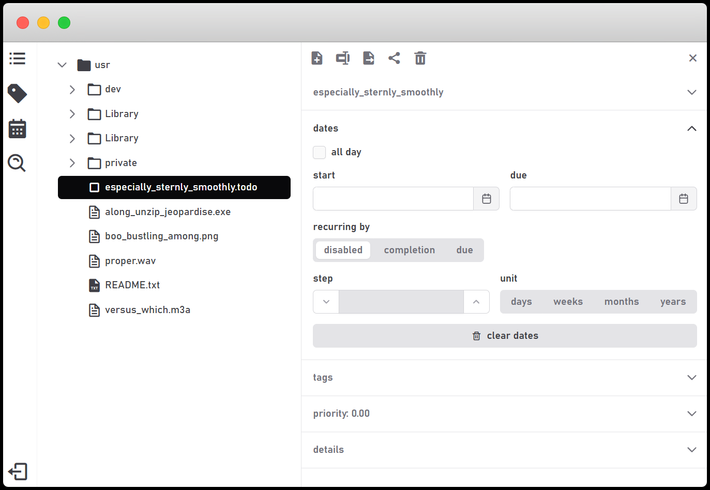

# Calystone

Calystone helps you organize your life through your file system with features like note taking and task management.

The project prioritizes privacy. It does not track or store data about you or your files. That said, always review the privacy policies of any services you connect. Read more in the [Privacy Policy](docs/PRIVACY_POLICY.md).

Calystone is open-source. You are welcome to run, copy, distribute, and study the software. More about this in the [license](/LICENSE) and in the [contributing guide](/docs/CONTRIBUTING.md).

The project is developed with care and always strives to improve its reliability, nevertheless, it is in early stages and does not provide any guarantees. Read more in the [Terms of Service](docs/TERMS_OF_SERVICE.md) and always maintain regular backups of your files.

You can learn more about the project in the following sections or go directly to the app clicking <a href="http://calyst.one" target="_blank">here</a>.

## Features

Our personal file systems are already a curated organization structure. We can represent areas of life and projects using directories, and within them, aggregate all relevant information.

Calystone harnesses that power by offering features around some of these files without limiting what you routinely do by demanding some special folder structure or use of a proprietary file format. **The project imposes itself a restriction that it should connect to the user file system as-is**.

The two most relevant features are note taking and task management. The goal is to let you create and read text notes so that your file system becomes a knowledge base. It enhances the editing experience by supporting formats like [markdown](https://en.wikipedia.org/wiki/Markdown). 

Secondly, the task management feature is activated when you create a file with the `.todo` extension. These files have a special editor that enables tracking of progress, priority, tags, and dates, for example.

Calystone also supports access to files through certain cloud providers, mainly to enhance usability on mobile devices where we usually don't have contextualized files locally. 

Unlike when navigating through our files using the file system directly, be aware that network data is used when accessing files through these services. It’s also important to understand that although the project has a strong position on [privacy](docs/PRIVACY_POLICY.md), when using those services you will be bound to their own terms and policies.

## Motivation

In recent decades, with the rise of SaaS and app stores, there is a move of the data placement from the file system to behind the app curtain.

Apps like Notion or Google Photos offer powerful features — but your data often becomes opaque and tightly coupled to the app. I am not arguing this is unreasonable or inherently bad, but from a personal point of view I sure don't like it.

I don't like it for two reasons. First is the expectation of a central knowledge base. If we have a project like a trip or a commercial enterprise, we will accumulate data around it in multiple formats like text notes, pdfs, images and spreadsheets, for example. 

For such endeavors, file systems offer an excellent abstraction to organize our digital lives. The directory structure can start very broad with main subjects like health, family and work, and you can freely drill down to categories and individual projects like that trip we were talking about. This organization represents our individual mental models much better than data spread in multiple apps, each one with its own form of organization.

A project’s PDF is more closely related to spreadsheets and images from the same project than to other projects PDFs.

The second aspect is longevity. Apps can shut down or become inaccessible, perhaps due to rising prices or the removal of essential features. When that happens, our data can be lost. Even when export options exist, they are rarely useful without significant effort on the user's part.

The combination of the file system and open formats is the ultimate remedy to this. They are your real personal database. Directories and files can be moved everywhere. We can change to another operating system, save our files in thumb drives, make backups on the cloud and control what to share or delete. 

Moreover, if your data is stored in an open format like text files, you can switch to a new app without concern when the old one is no longer available.

The Calystone project embraces this philosophy. If you found this discussion interesting, you can read more stuff about it in posts like [this](https://web.archive.org/web/20211227173721/https://www.al3x.net/blog/2009/01/31/the-case-against-everything-buckets) or [this](https://sive.rs/plaintext).

# Author

I hope this app can help you. It was made with ❤️ by [João Melo](http://joao.melo.plus).
