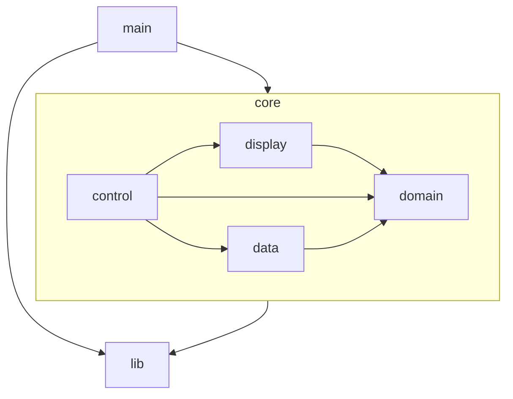
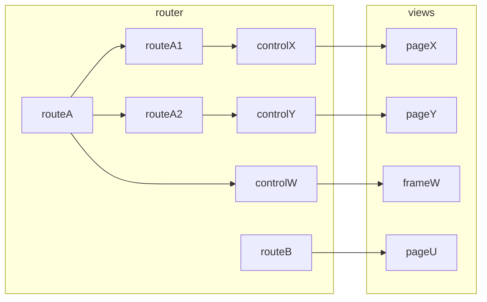
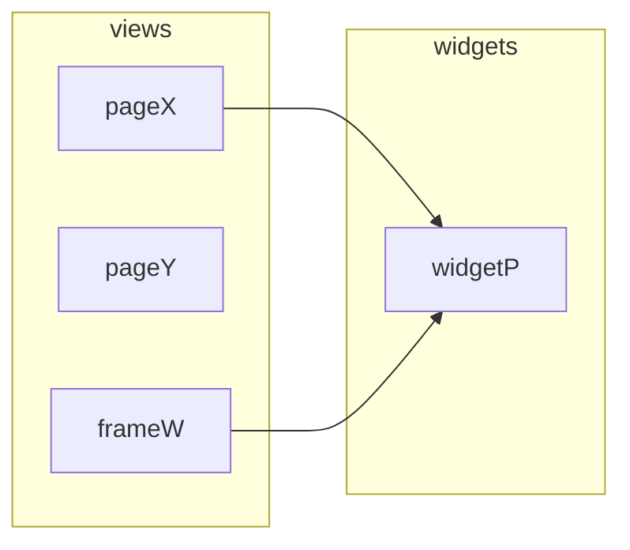

{{{name}}} {{description}}

# Architecture

## Layers

The arrows represent wich modules depends on. In that case the control module depends on the view module but the view knows nothing about the control.

## Main

Starts the applicaton, initializes app level state and stablish runtime dependencies.

## Control

Make the app data moves to attend the user signals. It transforms state from `data` to the format needed by `display` and convert events triggered by the user in `display` into action calls to `data`.

The top of the control structure starts at the route level. Routes are objects that define the SPA display entry points available to the user. The shape of the route objects are defined by the vue-router library API.

The route will render a zero or one control or view component. Routes can have children routes to enable control/view nesting. It can render a control for a frame in case of a shared layout and then a child route with the corresponding main page.

## Display

The display layer takes care of the app UI. The main sublayers are `views` and `widgets`.

### Views

Views are what the user see in the end. They know nothing about the app state. All data they need is received as props and every signal they send is done by events.

They receive and send data in the shape they need. Transformations must happen at the control level.

Views can be complex structures but will always worry only about the UI requirements and only change by that motivation. Controls carry the burden of translating interfaces between display and data.

### Widgets

They are view piecies reused by more than one page. They obey the same restriction as page components.

### Styles

Styles are guided by design tokens that came from the Prime Vue UI library (mainly colors) and from the Open Props library (mainly sizes).

The project uses vanilla CSS with design tokens coming from custom properties. The project does not use utility classes even when available. That is way open props is used instead of TailwindCss.

## Data

### Patterns

No classes. Promote complexity with excessive abstraction.

Data is centralized in a global object.

### Artifacts Representation

Every artifact gains a UUID and its parent UUID upon retriaval this is done to decouple it from other istances and make manipulation freer.

### Store

keeps reactive data to use in views. computations should be done in controls combining computed with data function. global store stores the basic raw data inside reactive constructs

## Domain

Domain is a small module that represent the most universal data types related to the bussiness logic. This type are very simple and are meant to unify the basic understating of the app amog modules.

These types are not meant to be flexible are adapt to very needs. The point here is simplicity and communality. Other modules will extedend themselves from the basic domain to futher implement their capacities.

## Lib

Everything that don't need to be aware of bussiness rules (domain) and don't need runtime state goes here. All lib components also don't are aware of each others.

Big lib means easy to mainting app.