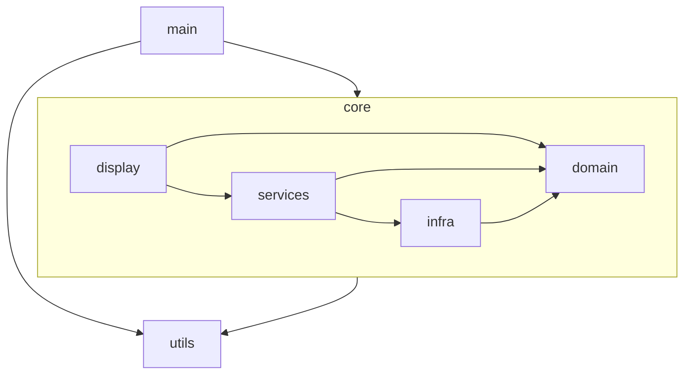
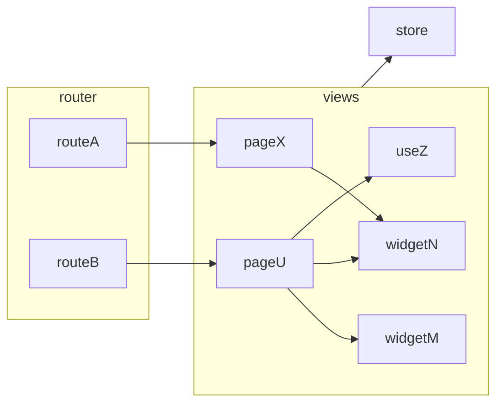

# Contributions

While I'm passionate about this project, I maintain it alongside my full-time job and family commitments. To ensure sustainable development and maintain mental health, I've decided to keep the project closed to external contributions for now.

*this file is still under construction from this point on, do not consider the information reliable*

# Architecture and Development Guidelines

## Modules

These are the top-level modules of the system. The arrows represent wich other modules that module depends on.

## Main

Starts the applicaton, initializes app level state and connect runtime dependencies.

## Display

Shows and transforms state using the `services` trough interactions with the user.

### Routes

The top structure starts at the route level. Routes are objects that define the url entry points available to the user. The shape of route objects is defined by the vue-router library API. 

The route will render one or more view components. 

The library supports the concept of nested routes to enable a sort of layout structure. This is discouraged in this app design. This approach couples the route configuration to the component tree and can becomes a maintence burden. 

Views should mount their layouts inside their own templates. They can reuse capabilities by composing the layout with other views.

### Views

While routes are url/component configuration, the views are what the user really see. Views access the services and domain via a central construct called store. All data they need, they grab from the store and user signals are convert to calls to the store inner objects methods.

Views can be complex structures in order to deal with data orchestration. They can abstract its capacities into subcomponets or composables to streamline code. If this sub strucutures are used only in one page they will live beside the page, if they are shared by multiple page, they should be moved to a new view submodules.

Shared UI logic decoupled from the business rules like buttons, toolbars and so on are encouraged to be externalized in components in the utils module. Also access to UI libraries is discouraged in the views module, prefer creating proxy ui components in utils.

### Styles

Styles are guided by design tokens that came from the Prime Vue UI library (mainly colors) and from the Open Props library (mainly sizes).

The project uses vanilla CSS with design tokens coming from custom properties. The project does not use utility classes even when available. That is why open props is used instead of TailwindCss.

## Domain

Domain is the app logic running in a vacum without care about any other core module. 

This is a simple module focus on representing data and behaviour that is not dependent of external media. These domain structures are not meant to encapsulate UI tasks. The point here is simplicity and communality. 

Service will later provide the UI with the appropriate use cases that are able to communicate with the infrastructure.

## Infra

Infra is the module with the logic to persist and recover real data for media like the file system and the local storage. It also provides utilities for things like checking if the user browser supports a specific technology.

Infra knows about the domain so it can manipulate the proper data structures but should not know about display and services.

### Orthogonality 

Diferent adapters tend to have some similarities as sometimes they offer diferent groups of featues from the same base technology or cloud provider. This tend to incentivize creating logic for cooperation between them.

This should be avoided. Changes on services tend to break this cooperations without really effecting the core features the adpater should be concern. Let cooperation be done in the service layer and avoid dependencies between adapters. 

To make things easier in the service layer, concentrate in fatctories or façades around a shared interface.

Be sure to demand clear data and let main and services decide if configuration is available to actually create adpaters.

## Services

Services implement typical use cases that will be consumed by one or more UIs.

Services are encouraged to have a small surface with few methods so they represent a specilized set of interdependent use cases decoupled from the rest of the app. 

At the same time, this methods are encourage to be deep and absorve complexity like validation and integration. Auxiliar classes are encouraged but must be hidden from consumers by top level service's methods.

## Utils

Here resides features used by multiple modules that have no knowledge about business logic. 

Be aware that generic lib features are considered bad design. Utils is not a candidate for a npm module. Everything should be written to attend the current needs. This isolation is meant for ease of maintance and not reuse in other apps.

# Design choices

These are not general design claims for the community. What follow are local decisions applicable only to this app. 

## Avoid uncertain use of complexity

Nothing in this app is coded with a mindset to be later used in other apps or libs. this kind of design bring complexity. This app code has to be as focused as possible. Some capability is added only when indispensible to achive some app known and present goal.

## Focused classes

Classes should be as single responsability as possible. They should do one thing and operate at a single level of abstraction.

You can create inner classes to isolate related groups of methods like in Hash and Hierarchy examples for the Nodes class.

[How small should a function be? - Robert C. Martin (Uncle Bob)](https://www.youtube.com/watch?v=rXjf8eiGsSI).

## Postpone branches and dependencies

If a class need two pieces of data to operate, postpone that as long as possible and require them at the method call level and insist in requiring only the data the method really need. 

Do not accept another class that has this data in the constructor. If this other class changes, now you have to update your class too. 

Even if this create more boilerplate. The code will be easier to understand and maintain.

## Do not use global stores

Global store incentivise black holes modules that aim to solve many problems.This creates unintended dependencies. Expose every bit of state carefully by atomic exposure.

## Test Modules not Files

No need to unit test every function and also no need to worry about the testing emcompassing inner structures. Tests should focus on verifying modules outcomes with none to litte mocking. Inner modules functions can change at will with side effecting multiple tests.

[There is No Such Thing as a Unit Test](https://dev.to/awwsmm/there-is-no-such-thing-as-a-unit-test-50j3)
