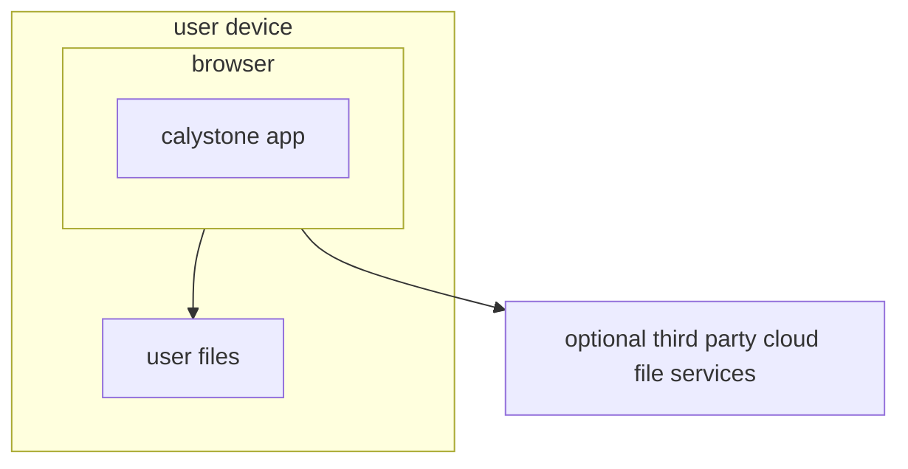
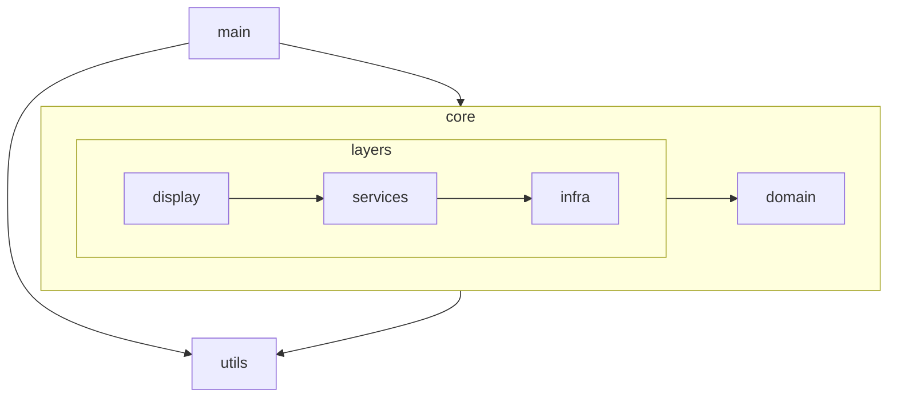
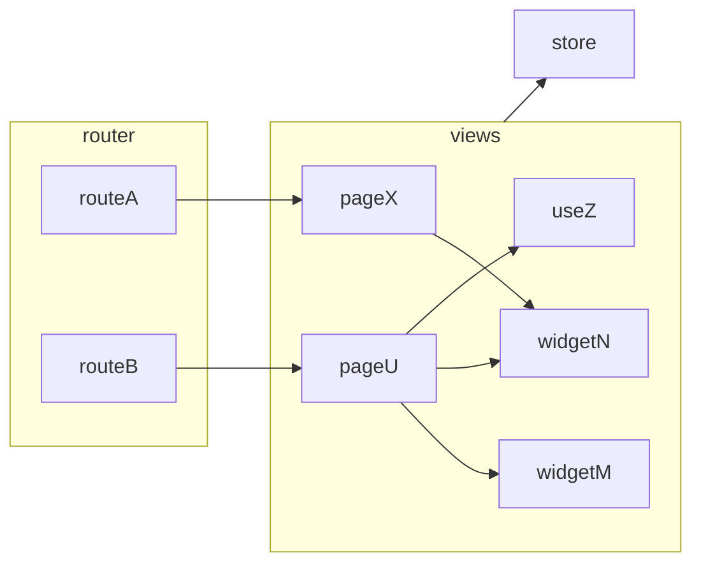

# Architecture and Development Guidelines

This file is a bucket for some development guidelines to guide the project through its lifecycle. Nevertheless, the information here should not be considered up to date. It is usually not in sync with the app's real-time status, and language errors may abound.

## Overview

Calystone is a web single-page application without its own backend. The app is served as static files to the user's browser and is able to offer its features using only the device's file system.

It can connect to third-party file system cloud services like Microsoft OneDrive using those services' APIs, but this is optional.

## Modules

These are the top-level modules of the system. The arrows represent which other modules each module depends on.

## Main

Starts the application, initializes app-level state, and connects runtime dependencies.

## Display

Shows state and translates the user's commands into calls to the appropriate modules.

### Routes

The top-level structure starts at the route level. Routes are objects that define the URL entry points available to the user. The shape of route objects is defined by the Vue Router library API.

The route will render one or more view components. 

The library supports the concept of nested routes to enable a sort of layout structure. This is discouraged in this app design. This approach couples the route configuration to the component tree and can become a maintenance burden.

Views should mount their layouts inside their own templates. They can reuse capabilities by composing the layout with other views.

### Views

While routes are URL/component configuration, the views are what the user really sees. Views access the services and domain via a central construct called the store. All data they need, they grab from the store, and user signals are converted to calls to the methods of the store's inner objects.

Views can be complex structures in order to deal with data orchestration. They can abstract their capacities into subcomponents or composables to streamline code. If these substructures are used only on one page, they will live beside the page; if they are shared by multiple pages, they should be moved to new view submodules.

Shared UI logic decoupled from the business rules (like buttons, toolbars, and so on) is encouraged to be externalized in components in the utils module. Also, access to UI libraries is discouraged in the views module; prefer creating proxy UI components in utils.

### Styles

Styles are guided by design tokens that come from the PrimeVue UI library (mainly colors) and from the Open Props library (mainly sizes).

The project uses vanilla CSS with design tokens coming from custom properties. The project does not use utility classes even when available. That is why Open Props is used instead of something like Tailwind CSS.

## Domain

Domain is the app logic running in a vacuum without care for any other core module.

The module focuses on representing data and behavior that is not dependent on external media. These domain structures are not meant to encapsulate UI tasks. The point here is simplicity and communality.

Services will later provide the Display module with the appropriate use cases that are able to communicate with the infrastructure.

## Infra

Infra is the module with the logic to persist and recover real data for media such as the file system and local storage. It also provides utilities for things like checking if the user's browser supports a specific technology.

Infra knows about the domain, so it can manipulate the proper data structures, but should not know about display and services.

### Orthogonality 

Different adapters tend to have some similarities, as sometimes they offer different groups of features from the same base technology or cloud provider. This tends to incentivize creating logic for cooperation between them.

This should be avoided. Changes in services tend to break this cooperation without really affecting the core features the adapter should be concerned with. Let cooperation be done in the service layer and avoid dependencies between adapters. If your goal was to make things easier in the service layer, concentrate on factories or facades around a shared interface.

Be sure to demand clear data and let main and services decide if configuration is available to actually create adapters.

## Services

Services implement typical use cases that will be consumed by one or more UIs.

Services are encouraged to have a small surface with few methods so they represent a specilized set of interdependent use cases decoupled from the rest of the app. 

At the same time, these methods are encouraged to be deep and absorb complexity like validation and integration. Auxiliary classes are encouraged but must be hidden from consumers by top-level service methods.

## Utils

Here reside features used by multiple modules that have no knowledge about business logic.

Be aware that generic lib features are considered bad design. Utils is not a candidate for an npm module. Everything should be written to meet the current needs. This isolation is meant for ease of maintenance and not reuse in other apps.

# Design choices

These are not general design claims for the community. What follows are local decisions applicable only to this app.

## Code only for this box

Nothing in this app is coded with a mindset to be later used in other apps or libs. This kind of design brings complexity. This app's code has to be as focused as possible. Some capability is added only when indispensable to achieve some known and present app goal.

## Focused classes

Classes should be as single-responsibility as possible. They should do one thing and operate at a single level of abstraction.

You can create inner classes to isolate related groups of methods, like in the Hash and Hierarchy examples for the Nodes class.

[How small should a function be? - Robert C. Martin (Uncle Bob)](https://www.youtube.com/watch?v=rXjf8eiGsSI).

## Postpone branches and dependencies

If a class needs two pieces of data to operate, postpone that as long as possible and require them at the method call level.

Also, insist on requiring only the data the method really needs. Do not accept another class that has this data in the constructor. If this other class changes, now you have to update your class too.

Even if this creates more boilerplate, the code will be easier to understand and maintain.

## Do not use global stores

Global stores incentivize black-hole modules that aim to solve many problems. This creates unintended dependencies.

## Test Modules not Files

No need to unit test every function and also no need to worry about the testing encompassing inner structures. Tests should focus on verifying modules' outcomes with none to little mocking. Inner modules' functions can change at will, with side effects on multiple tests.

[There is No Such Thing as a Unit Test](https://dev.to/awwsmm/there-is-no-such-thing-as-a-unit-test-50j3)
